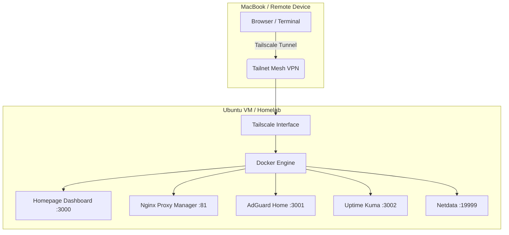

# 🚀 Secure Hybrid-Cloud Homelab
### A Remote-Access DevOps Lab with Docker, Tailscale, and Proactive Monitoring


## 📋 Project Overview
This project demonstrates the deployment of a containerized infrastructure on an Ubuntu VM. The primary goal was to create a **high-availability administrative environment** that is securely accessible from anywhere in the world (including mobile hotspots) without exposing any ports to the public internet.

## 🏗️ Technical Stack
| Category | Tools Used |
| :--- | :--- |
| **Virtualization** | Oracle VirtualBox / Ubuntu Server |
| **Containerization** | Docker, Docker Compose V2 |
| **Networking** | Tailscale (WireGuard), Nginx Proxy Manager |
| **Security** | AdGuard Home (DNS-over-HTTPS) |
| **Observability** | Netdata, Uptime Kuma |
| **Interface** | Homepage (Dashboard) |

---

## 🌐 Networking & Remote Access Challenge
One of the key engineering challenges was maintaining **DNS resolution** across different network perimeters (Home Wi-Fi vs. Mobile Hotspot).

* **The Problem:** Standard local DNS (`.lan`) fails when a client moves to a mobile network due to Carrier-Grade NAT and IPv6 conflicts.
* **The Solution:** I implemented a **Split-DNS** strategy using a **Tailscale Mesh VPN**. By routing only specific internal TLDs through the VPN tunnel, I ensured 100% uptime for my administrative tools without breaking public internet routing.

### Logical Network Flow

## 🛠️ Project Architecture & File Structure
I utilized a centralized directory structure to manage persistent data volumes ensuring that configuration files and databases remain intact across container restarts.


## 📊 Observability & Reliability
To adhere to SRE (Site Reliability Engineering) principles, I deployed a dual-layer monitoring stack:

Real-time Telemetry: Netdata provides per-second metrics for CPU, RAM, and Disk I/O.

Service Monitoring: Uptime Kuma tracks the availability of every container.

Status Page: A unified status page provides a transparent view of system health.

## 🚀 Deployment Guide
To replicate this environment:

Install Docker & Tailscale on your Ubuntu VM.

Clone the directory structure as shown above.

Initialize the stack:

```bash
cd ~/homelab
docker compose up -d
Connect the client: Install Tailscale on your local machine and join the same "Tailnet."
```
## 📈 Future Roadmap
[ ] Implement SSL/TLS certificates via Let's Encrypt and Cloudflare DNS.

[ ] Automate weekly backups of Docker volumes to an off-site S3 bucket.

[ ] Integrate Discord Webhooks for real-time downtime alerts from Uptime Kuma.

## 📝 Conclusion

This lab serves as a sandbox for testing DevOps workflows, network security, and container orchestration. It proves that a secure, enterprise-grade management environment can be built on consumer-grade hardware using open-source tools.


